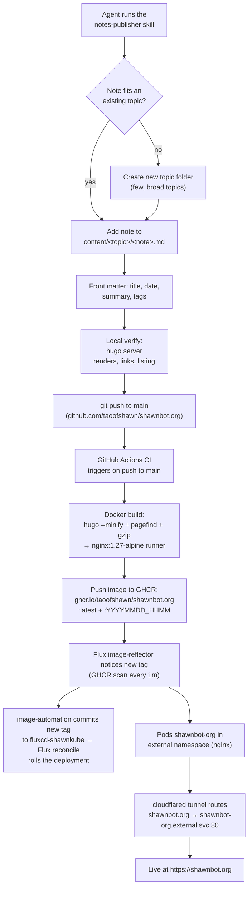

# Spec: shawnbot.org — Agent Notes Knowledge Base

**Status:** Draft for review
**Date:** 2026-02-14
**Owner:** Shawn

## 1. Purpose

Replace the current workflow of agent-generated untracked markdown files (created ad-hoc, moved around manually) with a searchable, navigable notes website hosted at **shawnbot.org**. The primary writer is an LLM agent; the primary reader is Shawn, reading later on any device.

### Requirements (from brief)

1. Static pages, published via a CI workflow that builds a container image with a web server inside (same pattern as shawndo.com).
2. An agent skill in the repo containing everything needed to create / publish / organize notes.
3. Easy-to-read design for disparate topics, with navigation and search.
4. Anthropic **frontend-design** skill installed at project level for design work. *(Already done: `.agents/skills/frontend-design/`.)*
5. Conservative CPU / memory footprint, like the existing Hugo blogs.

## 2. Research summary

Options evaluated for "agent writes markdown notes → readable searchable static site":

| Option | Runtime / build | Popularity | Fit for this project |
| --- | --- | --- | --- |
| **Hugo** | Single Go binary, no runtime deps | ~89k stars, very active (v0.164, Jul 2026) | **Best.** Matches existing shawndo.com stack; smallest build and serving footprint; huge theme pool |
| **Material for MkDocs** | Python + pip + plugins | ~27k stars, active (v9.7.7, Jul 2026) | Excellent docs UX (sidebar nav, search built in) but heavier build chain (Python/Node plugin deps) |
| **Quartz** | Node.js + Git | ~12.8k stars, active (v5.0, Jul 2026) | Purpose-built for Obsidian vaults (graph view, backlinks, wikilinks) but the heaviest runtime of the three |
| **Eleventy / Jekyll** | Node.js / Ruby | ~19.8k / ~51k stars | Flexible but no advantage here over Hugo; Jekyll slow-moving (last release Jan 2025) |
| **Self-hosted wikis (Wiki.js, BookStack, DokuWiki)** | Persistent server + database | Popular | **Rejected.** Requirement is a *static* site; a live wiki service is exactly the CPU/memory footprint we're avoiding |
| **Obsidian Publish / Flowershow / Digital Garden** | Hosted service or plugin+host | — | **Rejected.** Recurring cost or third-party hosting; we want self-owned, CI-built containers |

Sources: [VaultPicks — Obsidian Publish Alternatives](https://vaultpicks.net/obsidian-publish-alternatives/), [Obsidian forum SSG compilation](https://forum.obsidian.md/t/compilation-static-site-generator-for-publish-alternative/86784), [Hugo vs MkDocs comparisons](https://deuts.org/p/hugo-vs-mkdocs/), [Pagefind](https://pagefind.app/).

### Decision

**Hugo + Pagefind + nginx:alpine container.**

- Hugo: identical build philosophy to shawndo.com (single binary, fast, tiny image), so the operational knowledge transfers 1:1.
- Pagefind: build-time search index over the generated HTML; fully client-side at runtime — no search server, small bandwidth cost (index chunks load on demand). Better result quality than Hugo's default fuse.js JSON index for long notes.
- Theme: start from **hugo-book** (`alex-shpak/hugo-book`) — clean two-panel notes layout (sidebar nav + content), built for exactly this use case, and simple enough to restyle with the frontend-design skill. Alternative if hugo-book disappoints: **hugo-theme-relearn** (docs-focused, active).
- Serving: `nginx:1.27-alpine` runner stage, same as shawndo.com. Idle footprint ≈ single-digit MB RAM.

## 3. Repository layout (shawnbot.org)

```
.github/workflows/docker-image.yml   # CI: build + push GHCR image on push to main
Dockerfile                           # multi-stage: hugo build + pagefind → nginx:alpine
nginx.conf                           # gzip_static, caching headers (same pattern as shawndo.com)
hugo.toml                            # site config: base URL, menus, theme params
assets/ or themes/                   # hugo-book via Hugo module + overrides
content/
  _index.md                          # home: short intro + topic index
  <topic>/                           # one top-level folder per topic (e.g. networking/, homelab/, llm-tools/)
    _index.md                        # topic landing page (one-line description of the topic)
    <note>.md                        # a note
.agents/skills/notes-publisher/SKILL.md   # agent skill (see §5)
.agents/skills/frontend-design/           # installed anthropic skill (done)
.gitignore
README.md                            # human-facing quickstart (build, preview, deploy)
```

The repo is the single source of truth. Notes are ordinary markdown committed to `main`; publishing is just `git push`.

## 4. Note format conventions

Every note is a markdown file with Hugo front matter. Standard markdown only (headings, lists, code fences, tables, links) so any editor/agent can produce it.

```markdown
---
title: "Setting up UPS monitoring with NUT"
date: 2026-02-14
summary: "One-sentence summary shown in listings and search results."
tags: [nut, ups, debian]
---

Body markdown. Links between notes use standard relative markdown links
(`../other-note/`), not wikilinks, so the content stays portable.
```

Conventions:

- **Topic = top-level folder.** New topics are created only when a note genuinely doesn't fit an existing one (the agent skill enforces checking first). Fewer, broader topics beat many narrow ones.
- **One idea per note.** Titles are sentence-style and descriptive ("How X works", "Fixing Y") — they become H1s, search results, and listing entries.
- No timestamps in filenames (unlike shawndo.com blog posts); notes are topic-organized, not date-organized. `date` is front matter only.
- Images, if any, live in the note's folder (`note-name/` folder with `index.md` + assets), so they get processed and referenced portably.

## 5. Agent skill: `notes-publisher`

Location: `.agents/skills/notes-publisher/SKILL.md`. It must contain, self-contained:

1. **When to use** — any request whose output is a note/reference document destined for shawnbot.org (research write-ups, how-tos, decision records).
2. **Deciding placement** — list existing topics (read `content/*/`), pick the best-fit topic or justify a new one; naming rules for topics and notes.
3. **Creating a note** — exact front-matter template (§4), title/summary quality bar (the summary is what search and listings show), link style.
4. **Editing existing notes** — update `date` semantics (add `lastmod`), don't restructure topics without cause.
5. **Local verification** — `hugo server` command, what to check (renders, no broken links, listing looks right).
6. **Publishing** — commit to `main` and push; CI (§6) builds and pushes the image, and Flux image automation rolls the site within ~15 minutes (§7). Optionally watch the GH Actions run to confirm the build succeeded.
7. **Search hygiene** — why `summary` and `title` matter (Pagefind indexes built HTML; headings and first paragraph dominate results).

## 6. CI workflow

`.github/workflows/docker-image.yml` — mirrors shawndo.com exactly:

- **Trigger:** push to `main`.
- **Steps:** checkout → login to `ghcr.io` (via `secrets.GHCR_TOKEN`) → `docker build` → push two tags: `ghcr.io/taoofshawn/shawnbot.org:YYYYMMDD_HHMM` and `:latest`.
- **Dockerfile** (multi-stage, mirroring shawndo.com):
  1. Builder stage: alpine + `hugo` (edge/community repo) + node/npm; `COPY . .`; `hugo --minify`; `npx pagefind --site public` (writes the search index into `public/`); pre-compress text assets with `gzip -kf` for `gzip_static`.
  2. Runner stage: `nginx:1.27-alpine`; copy `public/` to `/usr/share/nginx/html`; copy `nginx.conf`.

No GitHub Pages or Netlify involved; the artifact is a container image, same as the other projects.

### 6.1 Flow: from skill run to published on shawnbot.org



Two repos cooperate: **shawnbot.org** (this repo — content + site + CI) builds and pushes the image to GHCR; **fluxcd-shawnkube** (gitea) holds the Deployment/Service that Flux applies to the `external` namespace. Anything on `main` is published — nothing hidden, nothing held back.

## 7. Serving & deployment (as built)

- Deployed to the k8s cluster (`kubernetes2026`) in the **`external` namespace** via **FluxCD**, matching the other standalone sites:
  - `Deployment shawnbot-org` — 2 replicas, labels `app: shawnbot-org`, `role: standalone-web`
  - `Service shawnbot-org` — ClusterIP, port 80
  - Manifest: `fluxcd-shawnkube/clusters/shawnkube/external/shawnbot-org.yaml`
- Currently running a placeholder `nginx:1.27-alpine` image; switches to `ghcr.io/taoofshawn/shawnbot.org:latest` once this repo's Dockerfile + CI exist.
- **Cloudflare tunnel** (token-based `cloudflared` pod in `external`) routes `shawnbot.org` → `http://shawnbot-org.external.svc.cluster.local:80` (tunnel ingress configured in the Cloudflare dashboard).
- **Footprint target:** nginx:alpine runner, no database, no runtime JS beyond Pagefind's client-side index; image well under 100 MB.
- **Image updates are fully Flux-driven (no manual steps after `git push`):**
  - Enable Flux's `image-reflector-controller` and `image-automation-controller` (their CRDs already ship in `gotk-components.yaml`; only the controllers need running).
  - `ImageRepository shawnbot-org` scans `ghcr.io/taoofshawn/shawnbot.org` every **10 minutes** (each scan is a lightweight tag-list API call, no pull unless a new tag exists).
  - `ImagePolicy` selects the newest `YYYYMMDD_HHMM` tag (alphabetical order = chronological for that format); the automation controller commits the new tag into `fluxcd-shawnkube`, and the normal Flux reconcile performs the rollout.
  - End-to-end latency for a note: CI build (~2–3 min) + scan interval (≤10 min) + rollout (seconds) ≈ **under 15 minutes from push to live**.

## 8. Design requirements

To be executed with the project-level **frontend-design** skill during implementation:

- **Readability first:** deliberate typeface choice and type scale, body line length < 80 characters, generous line-height, high body-text contrast. No web-font waterfalls — self-host or system stack.
- **Navigation:** persistent sidebar listing topics and their notes (hugo-book provides this); a topic landing page is always one click away; breadcrumb or topic label on each note page.
- **Search:** Pagefind UI — search box in the sidebar/top bar, results with title + summary snippet, keyboard accessible.
- **Restraint:** the site is for reading; no graph view, no analytics, no comment system, no decorative motion. One quiet visual identity, nothing that reads as a template default.
- **Mobile responsiveness (verified, no customization needed):** hugo-book's built CSS confirms a `max-width: 56rem` breakpoint that collapses the sidebar/TOC into a JS-free toggle on phones, plus `prefers-color-scheme` dark mode. The design pass refines typography and palette but does not have to rebuild layout for mobile.
- Mobile-responsive and light/dark readable (hugo-book ships both; palette tuned during implementation).

## 9. Out of scope

Comments, analytics, per-note access control, versioning UI, multi-user editing, Obsidian vault sync automation, RSS (decided: none).

## 10. Implementation plan (high level)

1. Scaffold repo: `hugo.toml`, hugo-book theme, sample content (2 topics, 3–4 notes) → verify `hugo server` renders.
2. Dockerfile + nginx.conf + CI workflow → verify image builds and serves locally (`docker run`), Pagefind search works.
3. Design pass with frontend-design skill (typography, palette, search UI placement) → verify against §8.
4. Write `.agents/skills/notes-publisher/SKILL.md` → verify by having an agent create a real note end-to-end.
5. Enable Flux image automation (§7) → verify end-to-end: note push → live on shawnbot.org.

## 11. Open questions

None remaining. Decisions locked in:

- Apex domain `shawnbot.org` — live via Cloudflare tunnel
- Deployment via FluxCD in the `external` namespace (§7)
- Image updates via Flux image automation, 10-minute GHCR scan interval (§7)
- All notes public
- Theme: hugo-book, confirmed mobile-responsive (§8)
- No RSS
- **Topic taxonomy: free-form topics created as needed** — no pre-defined list; the agent skill biases toward few, broad topics (§4)
